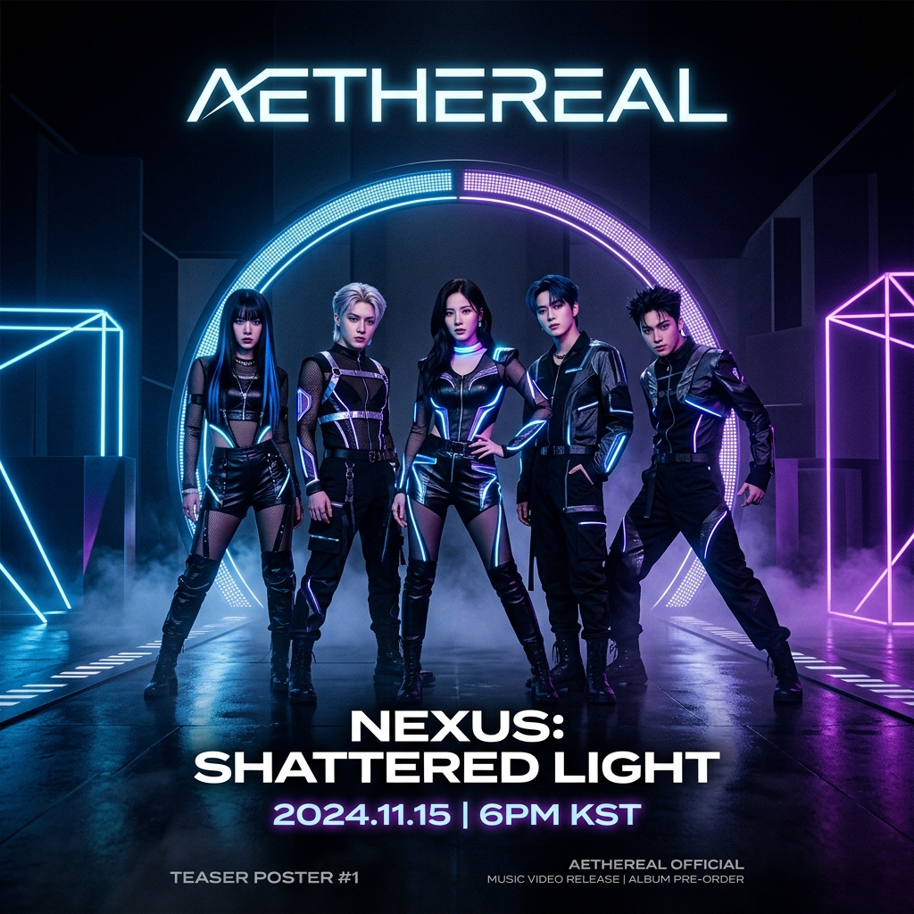

# 🌟 K-Anime Pulse


## 🚀 Sobre el Proyecto
**K-Anime Pulse** es una landing page vibrante y moderna diseñada para los amantes de la cultura pop japonesa y coreana. El sitio combina una estética premium con interactividad dinámica para ofrecer una experiencia única a los fans.

### ✨ Características Principales
- **Hero Area de Alto Impacto**: Diseño visualmente impresionante con estética *glassmorphism*.
- **📰 Últimas Noticias**: Grid de noticias con las tendencias más recientes en Anime y K-Pop.
- **🧠 Quiz Interactivo**: Un desafío para poner a prueba tus conocimientos y obtener un rango de fan.
- **📱 Totalmente Responsivo**: Optimizado para dispositivos móviles y escritorio.
- **🎨 Estética Futurista**: Paleta de colores neón, gradientes suaves y micro-animaciones.

---

## 🛠️ Tecnologías Usadas
- **Core**: HTML5 Semántico
- **Estilos**: Vanilla CSS3 (Custom Properties, Flexbox, Grid, Glassmorphism)
- **Interactividad**: JavaScript ES6+
- **Iconografía**: Font Awesome 6
- **Tipografía**: Google Fonts (Outfit & Inter)

---

## 📸 Vista Previa

### Noticias de Tendencia


### Desafío Quiz


---

## ⚙️ Instalación y Uso

1. **Clona el repositorio:**
   ```bash
   git clone https://github.com/Helmutdo/k-anime-web.git
   ```

2. **Abre el proyecto:**
   Simplemente abre el archivo `index.html` en tu navegador favorito.

---

## 🤝 Contribuciones
¡Las contribuciones son bienvenidas! Siente la libertad de abrir un *issue* o enviar un *pull request* para mejorar este portal.

---

## 📄 Licencia
Este proyecto está bajo la licencia MIT.

---
*Hecho con ❤️ para la comunidad de Anime & K-Pop.*
